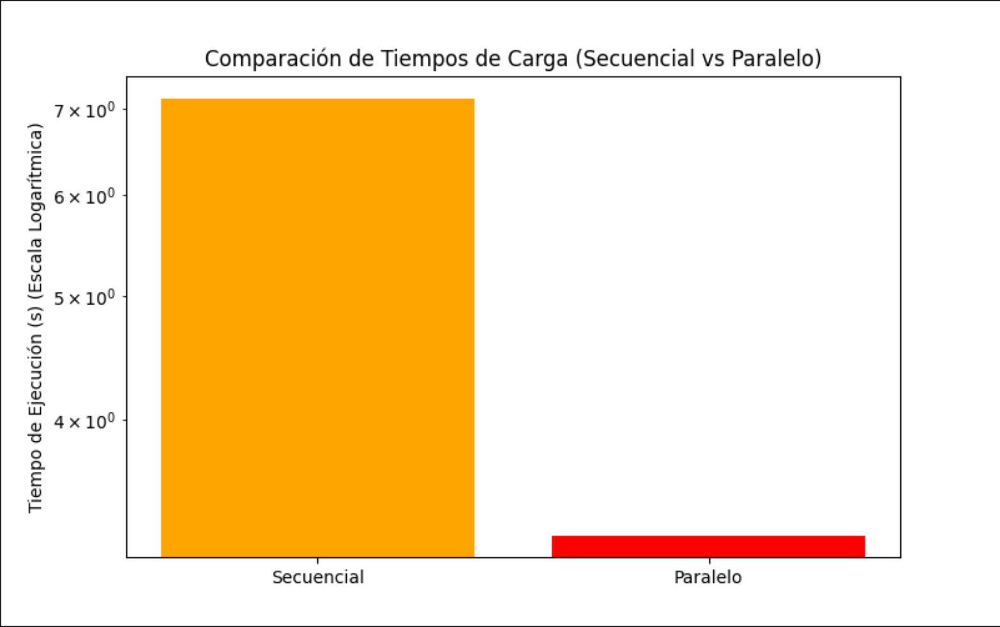

# Plataforma de Streaming: Proyecto Final (2024-2)

## Integrantes
* Ashly Nicole Veliz Barba (202210422)
* Darlene Priyanka Escobar Hinojosa (202310296)

---

## Descripción del Proyecto
Este proyecto implementa una **plataforma de streaming** con funcionalidades de búsqueda y recomendaciones de películas. Se enfoca en la eficiencia y escalabilidad mediante estructuras de datos avanzadas y patrones de diseño.

### Funcionalidades Principales
- **Búsquedas rápidas y eficientes** por palabras clave, frases o prefijos en títulos, sinopsis y etiquetas.
- **Sistema de recomendaciones** basado en "Me gusta" y similitud de tags o sinopsis.
- **Gestor de listas** para marcar películas en "Ver más tarde" y "Me gusta".
- **Optimización con AVL Tree** para ordenar y equilibrar la búsqueda de películas.

---

## Estructura del Proyecto

#### `DataProcessor.cpp` y `DataProcessor.h`
- Maneja la carga de datos desde archivos CSV y JSON.
- Implementa **Singleton** para garantizar una única instancia.
- Convierte CSV a JSON si el archivo JSON no existe.

#### `SearchTree.cpp` y `SearchTree.h`
- Implementa un **AVL Tree** para la búsqueda eficiente de películas por título y sinopsis.
- Organiza las películas de forma balanceada para optimizar las búsquedas.
- Integra **RelevanceCalculator** para calcular la relevancia de cada coincidencia.

#### `TagTree.cpp` y `TagTree.h`
- Implementa un **árbol binario de búsqueda** para organizar películas por etiquetas.
- Permite buscar películas por géneros o temas (#drama, #horror, etc.).

#### `RelevanceCalculator.cpp` y `RelevanceCalculator.h`
- Determina la **relevancia** de una película según la consulta de búsqueda.
- Asigna puntajes a coincidencias en título, sinopsis y tags.
- Ajusta la relevancia considerando el número de "likes".

#### `recomendador.h`
- Implementa un **Observer** que actualiza recomendaciones cuando se añaden películas a "Me gusta".
- Filtra y ordena películas similares según su relevancia.

#### `SimilitudFactory.h`
- Aplica el patrón **Factory** para crear instancias de estrategias de similitud (por tags o sinopsis).

#### `SimilitudSinopsis.h` y `SimilitudTag.h`
- **SimilitudSinopsis**: Encuentra películas similares analizando coincidencias de palabras clave en la sinopsis.
- **SimilitudTag**: Busca películas con etiquetas comunes.

#### `Ver_masTarde.h` y `Megusta.h`
- Manejan listas de "Ver más tarde" y "Me gusta" con una **Lista en Pila**.
- Integran el patrón **Observer** para notificar cambios y actualizar recomendaciones.
---
## Patrones de Diseño Implementados

### Singleton
- **DataProcessor**: Garantiza una única instancia para la gestión de la carga y almacenamiento de datos en JSON y CSV.

### Factory
- **SimilitudFactory**: Crea instancias de diferentes estrategias de similitud para recomendaciones de películas.

### Observer
- **Recomendador**: Recibe notificaciones cuando se agregan películas a "Me gusta" y actualiza las recomendaciones.
- **VerMásTarde** y **MeGusta**: Notifican a los observadores sobre cambios en sus listas.

### Strategy
- **AlgoritmoSimilitud**: Permite cambiar dinámicamente entre diferentes métodos de similitud (por sinopsis o por tags) para generar recomendaciones personalizadas.

---
## Algoritmo de Relevancia
El sistema usa la siguiente ponderación para calcular la relevancia de una película:
- **Título**: 5 puntos si coincide exactamente, 3 si es coincidencia parcial.
- **Sinopsis**: 3 puntos por cada aparición de la palabra clave.
- **Tags**: 4 puntos si la palabra coincide con un tag.
- **Likes**: Se ponderan con `(Likes / log(1 + total Likes))`.
- Se ordenan los resultados y se muestran los **5 más relevantes**.
---
## Comparación de Tiempos (Secuencial vs Paralelo)

El proyecto utiliza programación paralela para optimizar la carga y procesamiento de datos. Los siguientes resultados demuestran la eficiencia del enfoque paralelo:

| Líneas Procesadas | Secuencial (s) | Paralelo (s) | Aceleración |
|-------------------|----------------|--------------|-------------|
| Todo el archivo   | 7.14161        | 3.24764      | 2.20x       |

### Gráficos de Comparación
#### Comparación de Tiempos


---
## Interfaz y Uso
1. **Cargar películas desde CSV o JSON** (se almacena en JSON para futuras consultas).
2. **Buscar películas** por título, sinopsis o tags.
3. **Marcar películas en "Me gusta"** para recibir recomendaciones basadas en similitud.
4. **Agregar películas a "Ver más tarde"** para guardarlas en una lista.
5. **Obtener recomendaciones** automáticamente según tus preferencias.
---
## Instalación y Ejecución

### Backend
1. Abrir la terminal en el directorio del proyecto.
2. Crear y entrar al directorio de compilación:
   ```sh
   mkdir build
   cd build
3. Generar los archivos de compilación con cmake:
    ```sh
    cmake ..
4. Compilar el proyecto:
    ```sh
    make
5. Ejecutar la aplicación:
    ```sh
    ./bin/StreamingPlatform
---
# Conclusión
Este proyecto implementa una plataforma de streaming con estructuras de datos eficientes y patrones de diseño modernos. La integración de AVL Trees y búsquedas optimizadas permite resultados rápidos y precisos. Además, el sistema de recomendaciones personalizadas mejora la experiencia del usuario al sugerir contenido relevante basado en sus gustos.